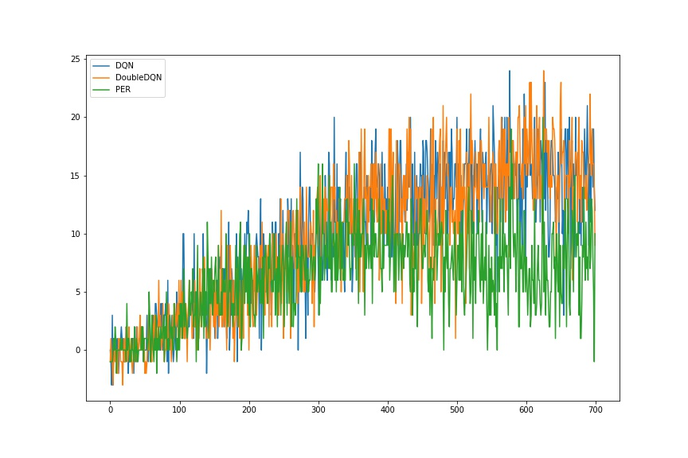
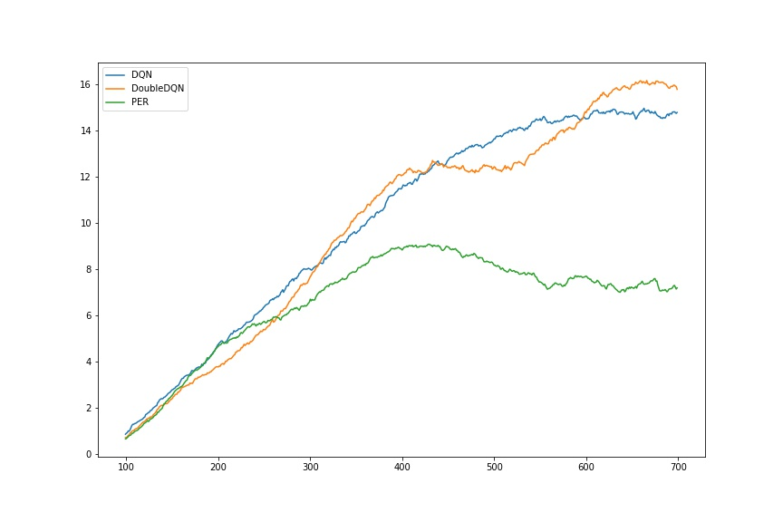

## Navigation project report


### Methods

To solve this project, I tried the following methods.

1. Deep Q-Netword (DQN)
2. Double DQN
3. Prioritized Experienced Replay (PER)

#### 1. DQN

##### Algorithm
My solution based on the code from coding exercise in lesson 2.
This model includes implementation of "Experience Replay" and "Fixed Q-Targets" techniques[^1].

In Q-learning, the raw transaction data $(S_t, a_t, r_r, S_{t+1})$ are highly correlated, and that correlation makes learning unstable. Experience Replay is a technique in which we pools generated transactions into a memory buffer, and then randomly samples pooled transactions from the buffer. This procedure reduces undesirable correlation.

Fixed Q-Targets is another technique to reduce correlation. In Q-learning update equation, the target value function is an approximation of the optimal value function. If we use currently learned value function $Q(S, a, w)$ as a target function, the result includes unnecessary correlation. In Fixed Q-Targets technique, we still use learned value function as a target function but stop parameter update for some time step. This modification reduces the correlation target value function and estimated value function and stabilizes learning.

##### Network

I used 3-dense layers network as a model. Each hidden units are (64, 64).
```
        self.fc1 = nn.Linear(state_size, fc1_units)
        self.fc2 = nn.Linear(fc1_units, fc2_units)
        self.fc3 = nn.Linear(fc2_units, action_size)
```
We added RL activations after the first and second layers. In the training phase I used Adam optimizer.

##### Hyperparameters

Hyperparameters of the training is the followings:

```
BUFFER_SIZE = int(5e4)  # replay buffer size
BATCH_SIZE = 64         # minibatch size
GAMMA = 0.99            # discount factor
TAU = 1e-3              # for soft update of target parameters
LR = 5e-4               # learning rate
UPDATE_EVERY = 4        # how often to update the network
eps_start=1.0           # initial epsilon value for epsilon greedy
eps_end=0.001           # minimum epsilon value for epsilon greedy
eps_decay=0.995         # decay rate of epsilon greedy
```

#### 2. Double DQN

##### Algorithm
In DQN, the target value function $Q(S, a, w^{-})$  is just an approximation of true optimal target value function $Q(S, a)^{*}$. Therefore approximated value functions may fluctuate around the true target value function. Such a fluctuation may give a larger value and a smaller value around the optimal Q value at the same frequency. However, in the parameter update process, we take a maximum of value function for all actions. This maximum operation makes an overestimation of value function because $\max_{a} Q(S, a, w)$ operation always picks up largest action values.

The idea of double DQN is to decompose the maximum operation into a selection of action and evaluation of the value function at the action[^2].
$$
    \max_a Q(S, a, w) = Q\left(S, \arg\max_a Q(S, a, w), w \right)
$$
The equation means the $\max_{a}$ operation include evaluation of $Q$ function twice. In double DQN, we use different value functions for action selection and action evaluations.
$$
    Q\left(S, \arg\max_a Q(S, a, w), w' \right)
$$
Here, $w'$ is another parameter vector which is different from original $w$. If $w'$ is sufficiently different from $w$, the selected action $a'= \arg\max_{a}Q(S, a, w)$ does not always gives the maximum of value function $\max_{a}Q(S, a, w) \neq Q\left(S, a', w' \right) $. Hence the modification will mitigate the overestimation of value function.

The implementation of double DQN is easy. Instead of evaluating maximum the target value function with next_state, I evaluate the next actions from estimated value function and select target value function from the estimated actions. 

```py
if self.use_double_dqn:
    next_action = self.qnetwork_local(next_state).detach().max(1)[1].unsqueeze(1)
    Q_targets_next = self.qnetwork_target(next_state).detach().gather(1, next_action)
else:
    Q_targets_next = self.qnetwork_target(next_state).detach().max(1)[0].unsqueeze(1)
```

##### Network

I use the same network as DQN.

##### Hyperparameters

Here, I used the same hyperparameters as DQN.

#### 3. Prioritized Experience Replay

In addition to Double DQN, I also tried Prioritized Experience Replay (PER) technique[^3]. The motivation of PER is that we think that the experiences with larger TD error are more important than experiences with smaller TD error. So we assumed that using large TD error experience more frequently leads to improvement of the learning process. To increase the sampling rate of large TD error experiences, we estimate the priority $p$ of experience with the following equation:
$$
    p_t = (|\delta_t| + e)^{\alpha},
$$
where the $\delta_t$ is the TD error at time step $t$, the $e$ is a small constant which prevents zero probability, $\alpha \in [0, 1]$ is a hyperparameter to interpolate how much prioritization is taken into account.
And sampling probability of $i$-th experience $P(i)$ is defined by
$$
    P(i) = \frac{p_i}{\sum_k^{N} p_k},
$$
where $N$ is buffer size.

To implement the PER, I referred to this article[^4]. In this article for efficiency sumtree data structure is used for efficiency.

### Result

Figure.1 is the plot of rewards as a function of episodes in the different approaches. I run the training up to 700 episode. The averaged score reached 13 in 500 episode. Finally, the score reached around 15 scores in the DQN and Double DQN.
Unfortunately, the PER agent couldn't reach 13 in 700 episodes which is worse than both of simple DQN and Double DQN. 

Why didn't the PER work well is not clear for now. I think that there are some approaches to investigate why the PER didn't work well. One approach is applying the same implementation for the other problems. If the result of PER is equally worse than simple DQN's score, there is a high probability that there is a bug somewhere in my implementation. 



Figure 1. Time evolution of score (Top) and moving averaged score (Bottom).
Each plot has three lines which depict DQN, Double DQN, and Prioritized Experience Replay (PER) results. The averaged scores of regular DQN and Double DQN reached 13 while PER saturated around 8 and gradually decreased after 400 episodes.

The animation of the trained agents are show as follows:


Figure 2. Trained agents. DQN, DoubleDQN, PER (from top to bottom).

### Ideas for Future Work

In this project, I do not attempt any parameter tuning. I want to examine how each parameter affects the agent performance. As well as parameter tuning, I will try different neural network model and investigate how the agent performance will change.

Optional Challenge (Learning from Pixels) seems a very exciting challenge. I think I should try this problem. In this challenge, I will try deeper convolution network architectures.

[^1]:https://web.stanford.edu/class/psych209/Readings/MnihEtAlHassibis15NatureControlDeepRL.pdf
[^2]:https://arxiv.org/abs/1509.06461
[^3]:https://arxiv.org/abs/1511.05952
[^4]: https://jaromiru.com/2016/11/07/lets-make-a-dqn-double-learning-and-prioritized-experience-replay/

